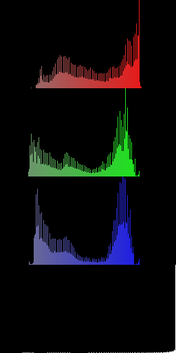
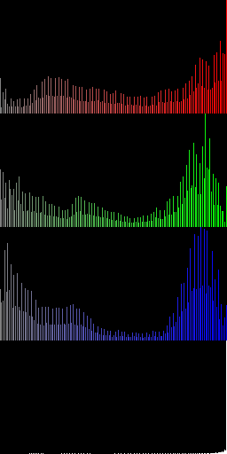

# Advanced Computing Systems 2022-2023 Lab 2 - CUDA

This repository contains all files and explanations needed to perform
the second lab of the CESE4010 - Advanced Computing Systems course at the
Delft University of Technology.

## What do I have to do for Lab 2?

Quick version:

* Download the baseline project.
* Implement each of the stages of an image processing pipeline using only CUDA 
    * You cannot use any CUDA-Accelerated Libraries or other external libraries,
      only pure CUDA / C / C++.
* Benchmark each of the stages.
* Optimize the final pipeline as much as you can.
* Write a report.
* Turn in your report.
* Rejoice with the knowledge that you have gained.

The long version:

The questions below can be read as a sequence, and they will become a
sort of lab manual!

## Can I fork this repository as a student?

Answer: __NO, DO NOT FORK IT (publicly)__. 
See the Lab 1 statement about this.

## What is CUDA?
CUDA is NVIDIA's proprietary (freeware) programming model for GPGPU. Originally 
CUDA stood for Compute Unified Device Architecture. We can use CUDA to program
GPGPUs like we did with OpenCL. However, CUDA has some advantages and some dis-
advantages that will be discussed in the lectures.

One major advantage of CUDA that the toolchain around it is very mature.
Especially the profiling tool is very useful for this lab. 
You are expected to use `nvprof` for this lab.
Also, the CUDA API is a bit more abstract, so it's a bit easier to write
CUDA code.

## How do I install CUDA on my own computer?

Even if you don't have an NVIDIA GPU, you can still install the CUDA toolkit.
This is useful if you want to use the graphical profiling tool `nvprof` and `nsight-sys`.

For Ubuntu, you can install CUDA toolkit by `sudo apt install nvidia-cuda-toolkit`.

* [NVIDIA CUDA Toolkit](https://developer.nvidia.com/cuda-toolkit)

## Where can I read some getting started / tutorials about CUDA?

NVIDIA has a few nice ones on their Developer Blog:

* [Easy introduction](https://devblogs.nvidia.com/easy-introduction-cuda-c-and-c/)
* [Even easier introduction using Unified Memory](https://devblogs.nvidia.com/even-easier-introduction-cuda/)
* [NVIDIA Visual Profiler intro](https://devblogs.nvidia.com/cuda-pro-tip-nvprof-your-handy-universal-gpu-profiler/)

## How do I compile and run the baseline project?

A CMake script has been supplied with the baseline project.
If you are in the project directory, you can type:

```console
mkdir debug
cd debug
cmake3 ..
```

This will create a build directory, go into that directory, and lets CMake 
create the project files there. Note that the CMake script will exclude files
from the build where you are supposed to implement technologies that your 
systems doesnt have any support for (it will complain about this on the 
command line).

Now you can build it with:

```console
make -j8
```

And run it with

```console
./imgproc-benchmark -h
```

To show help information.

## What does the baseline project do?

The baseline project implements an image processing pipeline that attempts
to make an image look as if it was reflected in rippling water.

It performs the following steps. Suppose we start with the following image:


1. Histogram calculation
    * We count the number of pixels with a specific intensity for each color channel.
    * This is used to determine the parameters for the next step.



2. Contrast enhancement.
    * We enhance the contrast by making the histogram "wider" for each channel.
    * In this way we get a "clearer" image:


* Also look at the resulting histogram:



3. Ripple effect.
    * We apply the ripple effect by doing some trigonometry.


4. Gaussian blur.
    * Because the ripple effect makes some parts of the image look rather
      jagged, smooth the final image using a Gaussian blur.


* That surely looks fancy!    

## What should I do with the baseline project?

You should read the baseline source code and figure out how the program works.

Then, you must:

* Implement the whole image processing pipeline using CUDA.

## How to fix the error "cudaErrorNoKernelImageForDevice"?

This error is caused by the fact that the CUDA compiler is using a higher [compute capabilities](https://docs.nvidia.com/cuda/cuda-c-programming-guide/index.html#compute-capabilities) than the GPU supports. You can find your GPU model by typing:

```console
lspci | grep VGA
```

On the login node (e.g. login1.hpc.tudelft.nl), you should find that the GPU model is "Quadro K2200". You can find out that the maximum supported compute capability for the K2200 is 5.0 using this [link](https://developer.nvidia.com/cuda-gpus). The [default compute capability](https://stackoverflow.com/questions/28932864/cuda-compute-capability-requirements) for CUDA 11.x is 5.2, which is a little higher than what the device can support.

So you need to tell the CUDA compiler that you want to use a lower compute capability to compile your code. You can configure this at the cmake stage:

```console
cmake3 -DCMAKE_CUDA_FLAGS="-arch=compute_50" ..
```

Remember to clean your cmake cache before configuring your project.


## What will you run to test if I've implemented everything correctly?

We will run the following test for all images that are supplied:

`imgproc-benchmark -a <image.png>`

## Help, I am tired of typing these shell commands.

You can write the commands in a shell script and execute it with `sh filename.sh`. All commands in that file will be automatically executed. A sample shell script to locally build and run lab2 is provided in `auto_build_run.sh`.

## How do I use `Nsight-systems` to profile my application?

[Nsight-systems](https://developer.nvidia.com/nsight-systems) becomes available when you load the CUDA toolkit. Use `nsys` to access its CLI version.

An example of profiling your application with Nsight-systems:

`nsys profile  ./imgproc-benchmark -a ../images/42.png`

After execution, you can find a report file called `report{x}.nsys-rep` in your build folder. Copy this file to your computer and open it with Nsight-systems installed on your computer (CUDA-supported GPUs not required). You should be able to see a detailed visual result like the one below.


## How do I use `nvprof` to profile my application?

For students who do not want to install `Nsight-system` on their computers, you can try an obsolete tool called `nvprof`. Just put `nvprof` in front of your application command.

Example:

`nvprof ./imgproc-benchmark -a ../images/42.png`

## I don't like looking at `nvprof` output on the command line. Is there a GUI?

Yes. It's called the NVIDIA Visual Profiler, or `nvvp` on the command line.
If you install the toolkit on your laptop, you can use this GUI to visualize the
profile.

You can then run `nvprof` with the `--output-profile <profile file name>.nvvp` option.
You can also enable `--analysis-metrics` for more elaborate nvvp options.

Example:

`nvprof --analysis-metrics --output-profile imgproc-benchmark.nvvp ./imgproc-benchmark -a ../images/42.png`

After you've run your application within `nvprof`, you can then copy the file
to your laptop/desktop and open it in the visual profiler tool. This [presentation](https://github.com/acstud/lab2/blob/master/lectureGPU_lab_updated.pdf) elaborates some more details with examples on using `nvprof`.

## Which image should I use to profile / discuss my implementations in the report?

The largest one, the other ones are supplied for debugging purposes. 
It is not recommended to start with the largest one.
Only when you are sure your implementation is fully debugged for the smaller
images, it makes sense to start the benchmarks on the largest one.
Avoid running large images on the login node because the login node is for debugging purposes. Performance results from the login node might be inaccurate under heavy load.

## Where are the files that I have to implement?

You can find them here:

[src/students](src/students)

## Can I change any other files?

You can do so, but it should not be necessary, unless you find any bugs.
If you find any, please let us know, and we will try to update the baseline
projects as soon as possible.

Other than that, if you change any of the files, you should explain in your
report why you did so.

## Is there a template for the lab report?

Yes. This is a [the LaTeX template](report/template.tex) and it is actually
__mandatory__ to use this template.

## Credits

* PNG support by: `https://github.com/lvandeve/lodepng`
* Image 42.png is a still from "The Hitchhiker's Guide to the Galaxy" by Touchstone Pictures.
* The Nudibranch lives happily at approximately `0°21'31.1"S 121°51'08.7"E`.
